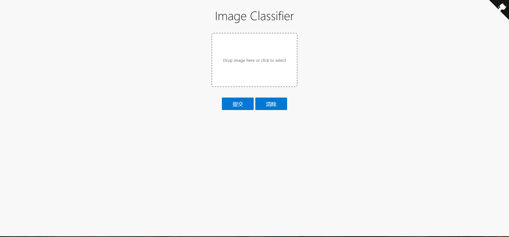

# 简介

## :rainbow: 介绍

## :sparkles: 功能

## :globe_with_meridians: 使用技术

## AI部分说明
首先装备数据集，我使用是[花卉数据集](https://storage.googleapis.com/download.tensorflow.org/example_images/flower_photos.tgz)  
把准备好的数据集放在dataset文件夹里目录结构如下：  
```
dataset_name
│   
│      
│
└───label1
│      file011.jpg
│      file012.jpg
│         ...
|
│   
└───label2
|
|      file021.jpg
|      file022.jpg
|       ...
...
```
然后用编辑器打开train.py文件，把Pre_training改为Falase  
如果你想用预训练模型进行训练的可以把模型文件放在model文件目录下，  
然后在train.py文件里models.load_model里输入模型的名字，  
再把Pre_training改为True就可以了。  
下载[miniconda](https://docs.conda.io/en/latest/miniconda.html)然后安装<font color="#dd0000">注意添加环境变量</font>打开终端输入以下：  
```CMD
# 创建虚拟环境
conda create -n tensorflow2 python=3.7.5
# 查看虚拟环境列表
conda env list
# 激活虚拟环境
conda activate tensorflow2
# 安装环境依赖
pip install -r requirement.txt
```
<font color="#dd0000">注意安装依赖时要移动到有requirement.txt文件目录下</font>不然会报错  
安装完依赖后运行`python train.py`就开始训练想看训练过程的  
情况的可以再打开一个终端进入tensorflow2环境移动项目目录然  
后`tensorboard --logdir=logs` 根据提示输入网址就可以看到过  
程了  

训练完后会在model目录下有以时间命名的模型文件，打开distinguishapp.py  
在class_names中添加你自己的标签在load_model读取自己的模型  
运行`python distinguishapp.py`然后在任何浏览器最好是谷歌  
浏览器输入http://127.0.0.1:8080/classifierhtml

除了可以用网页端看到效果外，也可以通过API来开发你自己的  
客户端。使用API方式如下：
http://127.0.0.1:8080/predict/(post请求)
```json
{
    "img_url":"图片的url"
}
```
返回结果是json就拿我的项目举例
```json
{
	"data": [
		{
			"name": "雏菊",
			"value": "0.024256058"
		},
		{
			"name": "蒲公英",
			"value": "0.9540851"
		},
		{
			"name": "玫瑰",
			"value": "0.007327111"
		},
		{
			"name": "向日葵",
			"value": "0.002556602"
		},
		{
			"name": "郁金香",
			"value": "0.011775156"
		}
	],
	"msg": "success",
	"status": "200"
}
```

